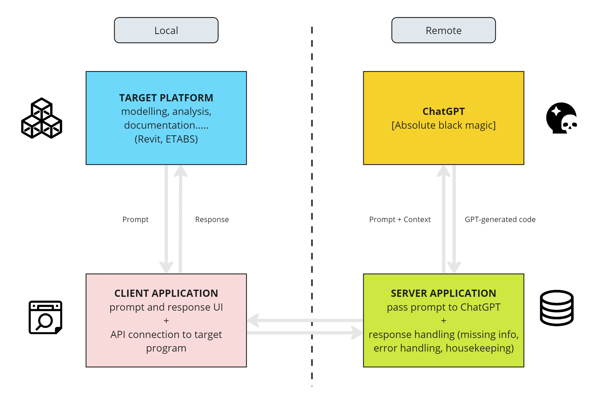

# Introduction

<!-- PROJECT SHIELDS -->
[![Contributors][contributors-shield]][contributors-url]
[![Forks][forks-shield]][forks-url]
[![Stargazers][stars-shield]][stars-url]
[![Issues][issues-shield]][issues-url]
[![MIT License][license-shield]][license-url]

<!-- PROJECT LOGO -->

  

  

    OpenAI inside Autodesk Revit
     
    <a href="https://github.com/rfeathers068/clippy-ai/Clippy.gif">View Demo</a>
  

<!-- TABLE OF CONTENTS -->

  
Table of Contents

  <ol>
    <li><a href="#about-the-project">About The Project</a></li>
    <li><a href="#workflow-overview">Workflow Overview</a></li>
    <li><a href="#technologies">Technologies</a></li>
    <li><a href="#building-clippy-ai">Building Clippy-AI</a></li>
    <li><a href="#roadmap">Roadmap</a></li>
    <li><a href="#contributing">Contributing</a></li>
    <li><a href="#license">License</a></li>
    <li><a href="#acknowledgments">Acknowledgments</a></li>
  </ol>

<!-- ABOUT THE PROJECT -->
## About The Project
Clippy-Ai is an openAI inside Autodesk Revit integration that enables users to make text-based prompts to the openAI gpt-4.0 model and receive live updates to their open model based on their requests.
* [Abhishek Bawiskar](https://github.com/abawiskar)
* [Matthew Breau](https://github.com/MBreauAtBBB)
* [Chris Chan](https://github.com/chriskc)
* [Russell Feathers](https://github.com/rfeathers068)
* [Alloy Kemp](https://github.com/alloy6063)
* [Francisco Maranchello](https://github.com/franmaranchello)
* [Peter Zhang](https://github.com/ZMPeterZhang)

(<a href="#readme-top">back to top</a>)

<!-- WORKFLOW EXAMPLES -->
## What does it do
</img>

(<a href="#readme-top">back to top</a>)

## Technologies
* Visual Studio 2022
* WPF
* OpenAI API
* RevitPy
* Flask

</img>

(<a href="#readme-top">back to top</a>)

<!-- Developer GETTING STARTED -->
## Building Clippy-AI
Build Clippy-AI yourself!

### Prerequisites
You will need the following libraries and/or software installed before getting to the fun!
* RevitPy
* Python, pip
* OpenAI Api Key

### Installing Client Application Locally
1. Install RevitPy
2. Point RevitPy Settings to clippyai\frontend e.g. C:\Users\RFeathers\Documents\GitHub\clippy-ai\frontend
3. Reload RevitPy

### Running Server Application Locally
1. Set up Local Python Environment
2. Copy OpenAI ApiKey as chatgptapikey.env file in server folder (just the key, no name needed)
3. pip install -r requirements.txt
4. python main.py

<!-- ROADMAP -->
## Short-Term Roadmap

- [ ] Better Context and Prompting
    - [ ] Adding in RevitPy Documentation Search and Context
    - [ ] Learning more and experimenting with prompting (https://www.promptingguide.ai/)
- [ ] Hosting on Cloud
    - [ ] Flask Server 
    - [ ] Updating Requests from frontend to include OpenAI key

See the [open issues](https://github.com/rfeathers068/clippy-ai/issues) for a full list of proposed features (and known issues).

(<a href="#readme-top">back to top</a>)

<!-- CONTRIBUTING -->
## Contributing
[Please see contribution guide](CONTRIBUTING.md)

<!-- LICENSE -->
## License
Distributed under the MIT License. See `LICENSE.txt` for more information.

(<a href="#readme-top">back to top</a>)

<!-- ACKNOWLEDGMENTS -->
## Acknowledgments
Thank you AEC Tech 2023, CORE Studio, Thornton Tomasetti, and the machines for making this hack possible [AECTech](https://www.aectech.us/).

(<a href="#readme-top">back to top</a>)

<!-- MARKDOWN LINKS & IMAGES -->
<!-- https://www.markdownguide.org/basic-syntax/#reference-style-links -->
[contributors-shield]: https://img.shields.io/github/contributors/rfeathers068/clippy-ai.svg?style=for-the-badge
[contributors-url]: https://github.com/rfeathers068/clippy-ai/graphs/contributors
[forks-shield]: https://img.shields.io/github/forks/rfeathers068/clippy-ai.svg?style=for-the-badge
[forks-url]: https://github.com/rfeathers068/clippy-ai/network/members
[stars-shield]: https://img.shields.io/github/stars/rfeathers068/clippy-ai.svg?style=for-the-badge
[stars-url]: https://github.com/rfeathers068/clippy-ai/stargazers
[issues-shield]: https://img.shields.io/github/issues/rfeathers068/clippy-ai.svg?style=for-the-badge
[issues-url]: https://github.com/rfeathers068/clippy-ai/issues
[license-shield]: https://img.shields.io/github/license/rfeathers068/clippy-ai.svg?style=for-the-badge
[license-url]: https://github.com/rfeathers068/clippy-ai/blob/master/LICENSE.txt
[product-screenshot]: images/screenshot.png

